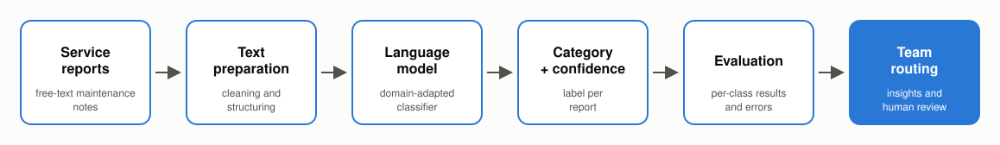

# Maintenance Text Classification – Case Study

**MSc course project · NLP for industrial maintenance · 2026**

> This repository is a public summary of a university project carried out with an industrial
> partner. It intentionally contains **no code, data, results or partner details**. The data
> and all outputs remain confidential.

---

## Overview

Industrial service teams write large volumes of free-text maintenance and service reports.
In this MSc project I explored how **natural-language processing** can structure that text
automatically, so the right information reaches the right team faster and recurring issues
become visible.

## What I did

- **Problem framing.** Turned an open business question into a well-defined text
  classification task, working with the industrial partner.
- **Data preparation.** Cleaned and structured real-world maintenance text: short, noisy,
  domain-specific language with abbreviations and uneven class sizes.
- **Modelling.** Adapted pre-trained language models to the domain and compared them with
  simpler baselines under one shared evaluation setup.
- **Evaluation.** Looked beyond overall accuracy at per-class performance and confusion
  between categories, to see where the model helps and where people are still needed.
- **Communication.** Presented findings and limitations to both technical and non-technical
  audiences.

## Outcome

- A working prototype that sorts free-text service reports into categories.
- A clear picture of which categories can be automated reliably and which need human review.
- Recommendations for next steps, including data-quality improvements at the source.

## Skills

`Python` · `NLP` · `Hugging Face Transformers` · `PyTorch` · `scikit-learn` · `pandas` ·
`text classification` · `model evaluation` · `Google Colab` · `stakeholder communication`

## Principles

- **Start from the user's problem**, not from the model.
- **Honest evaluation.** Per-class results and errors are reported, not only one headline number.
- **Human in the loop.** Low-confidence cases go to people instead of being forced into a label.

---

*Details are available on request, within the limits of the confidentiality agreement.*
